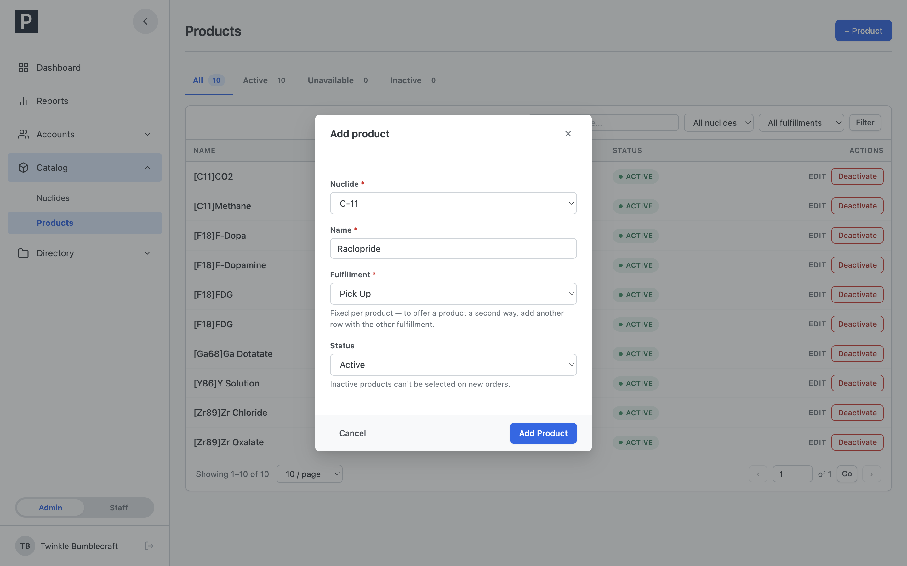
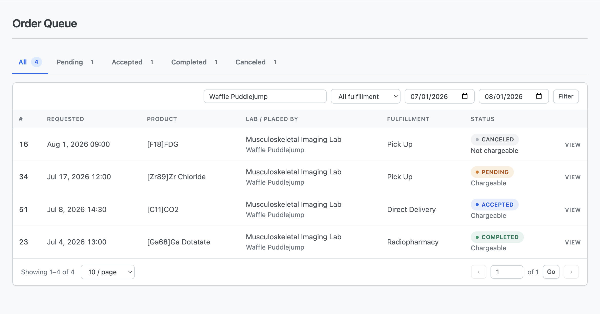

# PETOrders Architecture & Conventions

Audience: the developer inheriting this codebase. This is the "what you
need to know before you change anything" doc: the shape of the app, the
rules that are deliberate, and the gotchas that already bit someone
once. Scannable, not exhaustive. The code and `sql/schema.sql` are the
reference for details.

---

## Contents

1. [Stack](#stack-and-the-zero-dependency-rule)
2. [Directory layout](#directory-layout)
3. [Role model](#role-model)
4. [Catalog model](#catalog-model)
5. [Order lifecycle](#order-lifecycle-the-state-machine)
6. [Directory model (institutes/labs/PIs)](#directory-model-institutes--labs--pis)
7. [Gotcha: layout scope leak](#gotcha-layout-partials-share-the-pages-variable-scope)
8. [Shared helpers](#shared-helpers-check-here-before-writing-new-logic)
9. [Security posture](#security-posture)
10. [UI conventions](#ui-conventions)
11. [Dashboards](#dashboards)
12. [Decisions, not gaps](#things-that-look-like-gaps-but-are-decisions)

---

## Stack, and the zero-dependency rule

| Layer           | Choice                                      |
| --------------- | ------------------------------------------- |
| Language        | PHP 8.3, plain. No framework, no ORM        |
| Database access | PDO, prepared statements throughout         |
| Database        | MySQL 8.0 / MariaDB 10.11 (InnoDB, utf8mb4) |
| CSS             | Vanilla, system fonts                       |
| JS              | Vanilla, one `script.js`, no bundler        |
| Dependencies    | **None.** No Composer, no npm, no CDN       |

Every asset is local. The app makes no outbound requests and never sends
email. Deliberate constraint for the deployment environment. Don't add
dependencies.

## Directory layout

<details>
<summary>Full tree (click to expand)</summary>

```text
public/            # ONLY web-reachable folder (Apache doc root)
  .htaccess        # dotfile deny, no dir listings, ServerSignature Off,
                   #   ErrorDocument 404 -> /404.php (extensionless-URL
                   #   rewrite present but commented out)
  login.php, register.php, registration_status.php, change_password.php,
  index.php (redirects to /login.php), logout.php, account_profile.php,
  404.php
  customer/        # customer pages (dashboard, orders, order_detail,
                   #   new_order.php = POST-only JSON endpoint,
                   #   lab_delivery_locations, lab_product_users)
  staff/           # dashboard, orders.php (Order Queue), order_detail.php
  admin/           # dashboard, registrations, customers,
                   #   customer_detail, accounts, account_detail,
                   #   nuclides, products, institutes, labs, pis,
                   #   reports, export_csv
  favicons/        # favicon set + site.webmanifest (local, like all assets)
  assets/          # css/ (component library shared by all roles), js/script.js
src/               # application code, OUTSIDE the doc root, never URL-reachable
  config.php       # DB credentials (gitignored; template: config.sample.php)
  db.php           # get_db(): one memoized PDO per request
  auth.php         # login, lockout, sessions, require_role(), password policy
  helpers.php      # everything shared (see helper inventory below)
  partials/        # layouts, head, sidebar footer, new-order form/modal,
                   #   table_pagination, and the three shared
                   #   order-detail partials (order_cancel_modal,
                   #   order_cancellation_card, order_notes_card)
config/
  app_settings.php # static app-wide settings (display name); read via app_setting()
sql/               # schema.sql (source of truth), seed.sql (dev data),
                   #   eer-diagram.png (data-model diagram),
                   #   migrations/ (hand-run catch-up SQL for databases
                   #   that predate a schema.sql change)
tools/             # bootstrap_admin.php (production), set_temp_passwords.php
                   #   (dev), generate_stress_test.php (dev-only volume
                   #   data -- configurable synthetic-order count;
                   #   never in production)
```

</details>

The doc-root split is a security boundary: `src/` holds DB credentials
and is structurally unreachable by URL. Never move application code into
`public/`.

## Role model

Role is membership in a marker table, not a column on `users`.


_Role comes from membership in `customers`, `staff`, or `admins` (a subset of `staff`). Customers are further scoped by `lab_id`._

| Table       | Notes                                                                                     |
| ----------- | ----------------------------------------------------------------------------------------- |
| `customers` | Carries `lab_id` and `supervising_pi_id`. A customer's whole world is scoped to their lab |
| `staff`     | Staff accounts                                                                            |
| `admins`    | FKs to `staff.user_id`. Every admin is also staff                                         |

`determine_role()` (src/auth.php) checks admins, then staff, then
customers, in that order. Admin satisfies staff-only checks
(`role_satisfies()`), never the reverse. Neither satisfies customer.

Self-registration never writes to `users`. It creates a row in
`customer_registration_requests`. The account is created only when an
admin approves it.

## Catalog model


_Availability is computed live, not cascaded. Both the nuclide and the product must be active for the product to be orderable. Deactivating either leaves rows untouched._

| Rule             | Detail                                                                                                                                                                                                                                  |
| ---------------- | --------------------------------------------------------------------------------------------------------------------------------------------------------------------------------------------------------------------------------------- |
| Terminology      | isotope became **nuclide**, compound became **product**                                                                                                                                                                                 |
| UI rename        | `delivery_method` column displays as **"Fulfillment"** (code/schema unchanged)                                                                                                                                                          |
| Delivery method  | Fixed property of the product row, never chosen per-order. One compound offered two ways = two product rows (unique key: name + nuclide + method)                                                                                       |
| Availability     | Computed, never cascaded: `products.active = 1 AND nuclides.active = 1`. Deactivating a nuclide makes its products unavailable without touching their rows. Both gates live in `get_new_order_form_data()` and `validate_order_input()` |
| Lock after use   | Once any order references a product, its nuclide and fulfillment lock (UI-disabled + server-enforced). Workflow: create a new product row, deactivate the old one. Renaming is always allowed                                           |
| Pricing          | None, anywhere. Deliberate                                                                                                                                                                                                              |
| Catalog scoping  | None, per lab. Every available product is visible to every lab. Deliberate                                                                                                                                                              |
| Naming collision | "product" (catalog item) vs. "product user" (dose recipient in `lab_product_users`). Don't rename either                                                                                                                                |

## Order lifecycle: the state machine


_Four states (pending, accepted, completed, canceled), five transitions (accept, return, complete, cancel, reopen). Completed is the only terminal state._

| Transition | Who                                                      | Path                                |
| ---------- | -------------------------------------------------------- | ----------------------------------- |
| accept     | staff                                                    | pending → accepted                  |
| return     | staff                                                    | accepted → pending                  |
| complete   | staff                                                    | accepted → completed (**terminal**) |
| cancel     | customer (own pending order) or staff (pending/accepted) | → canceled                          |
| reopen     | staff                                                    | canceled → pending                  |

Hard rules:

| Rule               | Detail                                                                                                                                                                                                                                                                              |
| ------------------ | ----------------------------------------------------------------------------------------------------------------------------------------------------------------------------------------------------------------------------------------------------------------------------------- |
| Single path        | Every transition goes through `transition_order_status()` in `src/helpers.php`. Row-locks the order (`FOR UPDATE`), validates against the actor's role, writes the order update + `order_audit_log` row in one transaction. No call site bypasses it. Never invent a new transition. One deliberate carve-out: order **creation** is not a transition. `customer/new_order.php` inserts the order and its `NULL → 'pending'` audit row directly, in the same transaction |
| Cancel reason      | Required (`cancellation_reason`, 500 chars max), enforced inside `transition_order_status()`. Reopen clears it                                                                                                                                                                      |
| Audit log          | Status-only: order creation + each transition. No field-level diffing, don't add any                                                                                                                                                                                                |
| `chargeable`       | Independent of lifecycle. Staff-toggleable in any status, defaults true, deliberately not audit-logged. "Not chargeable" is the flagged exception in the UI. "Chargeable" is the quiet default                                                                                      |
| `notes`            | The only communication channel. One shared field, editable by staff always and by the customer on their own pending order, last-write-wins, no history, no staff-only channel                                                                                                       |
| Where actions live | Staff act on orders only from `staff/order_detail.php`. The Order Queue (`staff/orders.php`) is a pure triage list with no actions                                                                                                                                                  |

## Directory model (institutes / labs / PIs)


_Institutes contain labs. Labs and PIs are paired through `lab_pis`, managed only from the Lab modal in `admin/labs.php`._

| Rule            | Detail                                                                                                                                                                             |
| --------------- | ---------------------------------------------------------------------------------------------------------------------------------------------------------------------------------- |
| Availability    | Institute→lab mirrors nuclide→product: computed (`labs.active AND institutes.active`), no cascade writes                                                                           |
| Pairing UI      | Lab↔PI pairing lives in `lab_pis`, managed from one place only: the Lab modal's PI roster in `admin/labs.php`. `pis.php` has no pairing UI on purpose                              |
| `active` flags  | Gate only new-registration selection and changed-to assignments. Never affect existing customers or orders. Deactivating anything is always non-destructive                        |
| Admin edit rule | Keeping a customer's current lab + PI always saves (stale/inactive assignments never block an unrelated edit). Changing either requires the new lab and PI to be active and paired |
| Uniqueness      | DB unique keys: `institutes.name`, `institutes.shorthand_name`, and `pis.email` (required; PI email is not optional). Lab and PI names are intentionally not unique               |

## Gotcha: layout partials share the page's variable scope

The layouts (`src/partials/layout_customer.php` / `layout_staff.php` /
`layout_admin.php`) are plain `include`s executed mid-page, so any
variable they set lands in the including page's scope. This caused a
real bug: a layout's bare `$products`/`$locations` variables got
silently overwritten by a page that declared its own.

The fix, and the standing convention: everything a layout produces is
namespaced under a single `$petordersLayout` array. It holds account
identity, the current-page marker, sidebar state, and, for the customer
layout, the New Order modal's backing data.

| Before touching a layout                              | Do this                                                                                                  |
| ----------------------------------------------------- | -------------------------------------------------------------------------------------------------------- |
| Naming a variable on a page that includes a layout    | Check the layout for its reserved names first                                                            |
| `head.php`                                            | Expects `$pageTitle` from the caller                                                                     |
| Customer layout                                       | Reads a page-owned loose `$labId` (deliberate exception)                                                 |
| `customer/dashboard.php`, `customer/order_detail.php` | Read `$petordersLayout` fields after including the layout. Treat as an API surface if you touch the layouts |

The non-layout partials use the same include-scope mechanism, with two
named contracts:

- `table_pagination.php` **reads** `$tablePagination`, an array the
  including page assigns immediately before the include (keys:
  `idPrefix`, `itemLabel`, `hiddenFields`, `page`, `totalPages`,
  `pageSize`, `rangeStart`/`rangeEnd` from `paginate()`, `totalCount`).
  `canonicalize_get()` must have run first. The partial's links call
  `build_query()`, which reads `$_GET`. All 12 paginated list pages use
  it. Treat `$tablePagination` as a reserved name on any of them.
- `order_notes_card.php` **writes** `$orderNotesValue` into the caller's
  scope; reserved on both order_detail pages.

The three order-detail partials (`order_cancel_modal.php`,
`order_cancellation_card.php`, `order_notes_card.php`) are shared by
`customer/order_detail.php` and `staff/order_detail.php`. They take no
parameters: each reads the caller's scope and POSTs to
`$_SERVER['PHP_SELF']?id=<order_id>`, so the including page's own
handler receives the submit. `order_cancel_modal.php` branches its
hidden `action` on session role (`cancel_order` customer vs `cancel`
staff, a pre-existing naming split kept as-is so neither handler
changed). `order_cancellation_card.php` renders nothing unless the
order is canceled with a stored reason, so it's included
unconditionally.

## Shared helpers: check here before writing new logic

All in `src/helpers.php` unless noted:

| Helper                                                                        | Purpose                                                                                                                    |
| ----------------------------------------------------------------------------- | -------------------------------------------------------------------------------------------------------------------------- |
| `transition_order_status()`                                                   | the one lifecycle path (see above)                                                                                         |
| `validate_order_input()`                                                      | full order-form validation and normalization (lab scoping, direct-delivery location requirement, 24h HH:MM time)           |
| `get_new_order_form_data()`                                                   | nuclides/products/locations/product-users for the order form, availability-filtered                                        |
| `fetch_order_audit_trail()` / `describe_order_transition()`                   | audit feed and human-readable labels                                                                                       |
| `fetch_order_cancellation_actor()`                                            | who performed the → canceled transition (staff/admin collapse to "Staff")                                                  |
| `order_status_label()`                                                        | `orders.status` display label, a plain `ucfirst()` (the enum literal is 'canceled', American spelling, so no override is needed) |
| `can_edit_order_notes()`                                                      | notes-edit permission: staff/admin always, customer only on their own order                                                |
| `csrf_token()` / `csrf_field()` / `verify_csrf()`                             | CSRF token, hidden form field, and POST verification                                                                       |
| `e()`                                                                         | HTML escaping (htmlspecialchars, ENT_QUOTES, UTF-8)                                                                        |
| `redirect()`                                                                  | `Location` header + exit (the PRG redirect)                                                                                |
| `json_response()` / `request_wants_json()`                                    | the AJAX endpoint contract: emit `{ok, redirect/errors}` JSON and stop; detect script.js's AJAX-submit marker header       |
| `toast_flash()`                                                               | success toast after PRG redirect (also the pattern source for the `JSON_HEX_*` inline-script rule below)                   |
| `field_class()` / `field_error()`                                             | per-field validation display                                                                                               |
| `paginate()`                                                                  | clamped pagination math, consume its `rangeStart`/`rangeEnd`, don't recompute                                              |
| `form_action()` / `build_query()`                                             | list-page actions/links that preserve filter and page state. `build_query()` omits empty/default params and returns its own leading `?` (or `''`); never prepend another `?`, and same-page anchors must prepend `$_SERVER['PHP_SELF']`, because an empty `href=""` resolves to the current URL, not the bare path |
| `canonicalize_get()`                                                          | writes validated/clamped filter values back into `$_GET` before any link is built; required before `build_query()`/the pagination partial |
| `where_clause()` / `like_contains()`                                          | WHERE-fragment joiner; LIKE-wildcard escaping wrapped in `%…%` (pair with `ESCAPE '\\'`)                                   |
| `bootstrap_session()`                                                         | hardened `session_start()` (httponly, samesite=Lax, secure per config). Every page uses this, never bare `session_start()` |
| `asset_url()`                                                                 | root-relative asset URL with `?v=<mtime>` cache-busting                                                                    |
| `app_setting()`                                                               | reads `config/app_settings.php`                                                                                            |
| `csv_safe()`                                                                  | CSV formula-injection neutralization (used by the report export)                                                           |
| `mark_orders_seen()` / `consume_arrival_flags()`                              | "updated since your last visit" timestamp; one-shot PRG arrival flags (`?placed=1` etc.) captured and stripped from `$_GET` |
| `layout_account_data()` / `current_customer_lab_id()`                         | sidebar identity + My Info data; the signed-in customer's lab id                                                           |
| `customer_display_name()`, `delivery_method_label()`, `format_activity_mci()` | display formatting                                                                                                         |

Constants: `DEFAULT_PAGE_SIZE` (10), `PAGE_SIZE_OPTIONS`
([10, 20, 50, 100]), and `BUILD_QUERY_DEFAULTS` (the no-op default
values, `page=1` and `page_size=10`, that `build_query()` drops so query
strings stay clean). Reuse, don't redefine. script.js's
`FORM_FIELD_DEFAULTS` (used by `initFilterFormCleanup()`, the
form-submission counterpart that disables empty/default GET fields
before native submits and never lands on a bare `?`) mirrors
`BUILD_QUERY_DEFAULTS`. Keep the two in sync.

One deliberate anti-DRY case: `generate_temp_password()` is duplicated
per-file on purpose (five copies: registrations, customer detail,
account detail, accounts list, bootstrap tool). Copy the shape, don't
centralize it.

## Threat model

**Read this before changing anything in the security posture table below.**

This application is designed for **one** deployment shape:

> An internal NIH server, reachable only from the NIH intranet, served over
> HTTPS, behind network-level access control.

That is a **precondition of the design**, not an observation about it. Several
decisions are only defensible because of it, and a number of past decisions
cited it explicitly as their justification.

### What the intranet assumption is doing for us

| Assumption | What depends on it |
| --- | --- |
| Requests come from inside the NIH network | The absence of any WAF, bot filtering, or CAPTCHA |
| Callers are identifiable NIH staff | Registration being open and unauthenticated |
| An attacker cannot reach the app anonymously from the internet | The lockout countdown message (PR #96), which discloses that a given username exists |
| Network access is itself an access control | The absence of MFA |

### What the intranet assumption is NOT doing for us

An intranet is **not** a trust boundary. It does not stop a compromised
workstation, a malicious insider, or malware moving laterally. Every control
in the table below must hold against a caller who is already inside the
network. In particular, do not reason "we're on the intranet, so this doesn't
need a limit" — that reasoning produced finding H1 (a 365-day account lockout
usable as a denial-of-service by anyone who could guess a username).

### If this app is ever exposed to the internet

Treat that as a **new project with a new threat model**, not a configuration
change. At minimum, revisit every row above, and:

- Put authentication in front of the whole site (HTTP Basic Auth at the Apache
  level, or an SSO reverse proxy) — see `docs/DEMO_DEPLOYMENT.md` §5
- Re-examine open registration: it is an unauthenticated write endpoint
- Re-examine every message that distinguishes "no such account" from "that
  account exists" (the lockout countdown, the registration duplicate messages)
- Seed no real institute, lab or PI data into a public instance

A public demo built from this codebase existed in August 2026
(`docs/DEMO_DEPLOYMENT.md`). The Basic Auth layer that made it defensible was
later removed, leaving the app's own login as the only gate. Do not repeat that.

## Security posture

| Category        | Detail                                                                                                                                                                                                       |
| --------------- | ------------------------------------------------------------------------------------------------------------------------------------------------------------------------------------------------------------ |
| SQL             | PDO with real prepared statements (`ATTR_EMULATE_PREPARES = false`), exceptions on error, utf8mb4 DSN charset                                                                                                |
| CSRF            | Token on every POST, rotated at login                                                                                                                                                                        |
| Sessions        | httponly + SameSite=Lax cookies, `secure` when `REQUIRE_SECURE_COOKIES` is on, 15-minute idle timeout, session ID regenerated at login                                                                       |
| Login lockout   | 5 failed attempts locks for 15 minutes; 10 locks for 1 hour. **Both tiers are deliberately bounded** — an earlier version locked for 365 days, which was usable as a permanent denial-of-service against any guessable username and left no recovery path through the UI (finding H1). Admins have a dedicated **Unlock Account** action (`admin/account_detail.php`, `admin/customer_detail.php`) that clears the lock without forcing a password change. An expired lock resets the failure counter, so a served lock does not re-trigger on the next mistyped password. Complemented by per-IP throttling (`throttle_*` in `src/helpers.php`), which catches one source spraying attempts across many accounts. The user is told the account is temporarily locked, with minutes remaining (shown on the locking attempt and on every attempt while locked). Recorded in `lockout_events`, logged server-side, surfaced on the admin dashboard. **The countdown message is a deliberate tradeoff:** it was removed in a security review (PR #57) as account-enumeration hardening, then knowingly restored (PR #96) because this app is intranet-only behind badge access. Don't revert it to a generic message without revisiting that decision |
| Password policy | 12+ chars, at least one letter and one number, can't contain the username/email, can't match the last 5 passwords (`password_history`). Admins trigger resets but never see or choose a user's real password. Hashed with bcrypt at cost 12 (`PASSWORD_BCRYPT_COST` in `src/auth.php`, up from PHP's default of 10 — a few tens of milliseconds per verify, irrelevant at this app's login volume). Existing hashes keep working; `password_verify()` reads the cost from the stored hash, so only new/reset passwords pick up the higher cost |
| Authenticated request | `require_role()` re-checks `users.active` live and re-derives the role from table membership (which is why promote/demote and deactivation take effect on the target's next request), enforces the 15-minute idle timeout and the 12-hour absolute session cap, and forces `/change_password.php` while a temp password is in effect |
| Every request (incl. unauthenticated) | `send_security_headers()`, called from `bootstrap_session()`, sets `Content-Security-Policy` (nonce-based; no `unsafe-inline`), `X-Frame-Options: DENY`, `X-Content-Type-Options: nosniff`, `Referrer-Policy: same-origin`, `Cache-Control: no-store`, and `Strict-Transport-Security` on HTTPS requests. **These used to live in `require_role()`**, which meant `login.php`, `register.php`, `registration_status.php`, `404.php` and `index.php` — including the login form itself — received none of them (finding M1). Do not move them back |
| Inline scripts | Every inline `<script>` must carry `nonce="<?= e(csp_nonce()) ?>"` or the CSP will block it. Inline event attributes (`onclick=`, `onchange=`) are blocked outright — delegate in `script.js` instead (see `data-auto-submit`) |
| Audit trail | `auth_events` records every login success, failure, lockout and admin unlock with source IP and user agent. Previously only lockouts were recorded, so successful access left no trace |
| Registration status page | Returns status only. The admin-authored `rejection_reason` is **not** shown on this unauthenticated page (finding M4): escaping prevents XSS, but nothing prevents an admin from typing PHI or third-party detail into a field the whole network can read |
| Registration form data exposure | `register.php`'s PI dropdown query no longer selects `pis.email` (finding H2). It's an unauthenticated page, so every column it queries is effectively public; shipping every active PI's email built a ready-made spear-phishing target list of NIH PIs for anyone who loaded the form. The PI name alone is enough to pick the right PI from the (already lab-filtered) dropdown. Don't re-add email to that query or its `<option>` label |
| Maintenance scripts | Every script in `tools/` refuses to run outside `PHP_SAPI === 'cli'` (404s if reached over HTTP; finding H4). The scripts already live outside the document root by design, but that's a deployment convention, not an enforced boundary — one `AllowOverride`/vhost mistake would have exposed them. `tools/set_temp_passwords.php` also no longer sets every account to a hardcoded shared string (`'TempPass123!'`, previously committed to git) — it mints a unique CSPRNG password per account and refuses to run without `--i-understand-this-is-not-production` |
| Inline-script JSON | Any `json_encode()` that echoes request-derived data into an inline `<script>` uses `JSON_HEX_TAG \| JSON_HEX_APOS \| JSON_HEX_QUOT \| JSON_HEX_AMP` (no `</script>`/quote breakouts). Pattern source: `toast_flash()`. Applied across the 7 error-modal-reopen blocks (admin nuclides/pis/labs/institutes/products, customer lab_delivery_locations/lab_product_users). Deliberately exempt: `json_response()` (a real JSON HTTP body) and `labs.php`'s `data-*` attribute encodes (`e()`-wrapped HTML attributes). Don't "fix" those |
| Errors          | `display_errors` off. Global exception handler logs and renders a generic 500 page                                                                                                                           |
| Timezone        | Pinned to `America/New_York` in code. `src/db.php` also pins the DB session's `time_zone` to PHP's own offset on every connection, so MySQL-written `TIMESTAMP` columns (e.g. `orders.created_at`, `auth_events.occurred_at`) and PHP-written datetimes (e.g. `users.locked_until`) agree — a stock cloud DB image defaulting to UTC would otherwise silently misdate the audit trail |

## UI conventions

| Convention          | Detail                                                                                                                                 |
| ------------------- | -------------------------------------------------------------------------------------------------------------------------------------- |
| CSS                 | One shared component library for all three roles. No role-specific stylesheets                                                         |
| Success flow        | POST redirects (PRG), then toasts via `toast_flash()`                                                                                  |
| Errors              | Inline `.alert--error` plus per-field messages                                                                                         |
| Exception           | Temporary password reveals use a read-once session flash with a 60-second TTL, never a toast, never the URL                            |
| Destructive actions | `data-confirm*` attributes intercepted by `script.js` into a custom modal, never `window.confirm`                                      |
| List pages          | `.status-tabs` strip with live counts, explicit-submit filter forms (never live-as-you-type), shared pagination partial (`table_pagination.php`, fed via `$tablePagination`; see the gotcha section). Query strings stay clean: links (`build_query()`) and native form submits (`initFilterFormCleanup()` in script.js) both omit empty/default params and never emit a bare `?` |
| Count queries       | Joins that exist solely to back the optional search box are added only when the search term is active, never unconditionally. Each tab-counts query joins only what its active filters reference: full join set when searching, `products` alone for the fulfillment filter, bare `orders` otherwise (`staff/orders.php`, `customer/orders.php`). Performance only. Results are identical in every branch, since every droppable join targets a PK via a NOT-NULL FK |
| List sorting        | Intentionally divergent: `customer/orders.php` keeps one fixed newest-requested-first sort on every tab (order history), `staff/orders.php` sorts per status tab (triage: pending/accepted soonest-requested first, completed/canceled most recently updated first). Commented in both files; don't align them |
| Create/edit modals  | One skeleton (copy `admin/nuclides.php`'s Add modal). Dirty-tracking + discard-confirm are shared via `window.petordersWireModalDirtyTracking()` in script.js. Each page supplies its own `snapshotForm()` since what counts as a field value varies (labs.php keys its `pi_ids[]` roster by name+value, products.php skips disabled locked-mirror fields). Modal shell intentionally not a shared partial. The one exception is `order_cancel_modal.php`, shared by the two order_detail pages |
| Order times         | 24-hour `HH:MM` text inputs (pattern-validated), never a native time picker. Real department requirement                               |
| Badges              | Dotted pills for statuses, square no-dot chips for facts (role, "Not chargeable")                                                      |
| Color scheme        | Light mode only. No dark-mode tokens, no `prefers-color-scheme` anywhere in the CSS; don't add them                                   |

## Dashboards

All three dashboards follow one shape: four stat tiles plus preview
lists, refined deliberately (PRs #86–#88):

| Convention           | Detail                                                                                                                                                                                                                                        |
| -------------------- | ---------------------------------------------------------------------------------------------------------------------------------------------------------------------------------------------------------------------------------------------- |
| Stat tiles           | Customer: Pending / Upcoming / Requested This Month / Total. Staff: Pending / Accepted / New Today / Total. Admin: Pending Registrations / Active Customers / Active Staff / Admins                                                            |
| Honest deep links    | A tile links to a filtered list only when an exactly matching filter exists. Staff's New Today and Total tiles link unfiltered on purpose: `staff/orders.php` can't filter on `created_at`, and a mismatched filter would lie                  |
| `LIMIT 5` previews   | Customer Recent Orders (newest requested time first), staff Due Today & Overdue (pending/accepted requested by end of today, soonest first, overdue included, no lower bound), admin Pending Registrations preview and Recently Added Customers |
| Uncapped exceptions  | Admin's Lockouts and Rejected Registrations panels use a 7-day window with **no row cap**: each is a complete record for its window, so a burst of events can never silently scroll off the list. Don't re-add a cap                          |
| No urgency dots      | Urgency/state is plain text (tile meta lines; the staff table's "Timing" column reading "Overdue"/"Due today"), never a colored dot. The one surviving dot is `.dot--info`, the customer "updated since your last visit" flag, not urgency    |

## Things that look like gaps but are decisions

Don't "fix" these. They're requirements:

| Missing                               | Status                                               |
| ------------------------------------- | ---------------------------------------------------- |
| Email sending                         | None, ever                                           |
| Cost/pricing fields                   | None                                                 |
| Phone-in-order flag                   | None                                                 |
| Per-order quantity limits             | None                                                 |
| Staff-only notes channel              | None                                                 |
| Field-level audit log                 | None                                                 |
| Category concept (products or staff)  | None                                                 |
| App-level uniqueness for lab/PI names | None                                                 |
| Customer profile self-edit            | Admin-only. Customers can only change their password |
