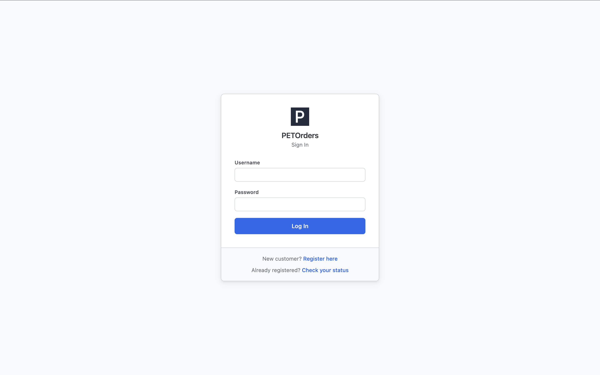

# PETOrders Production Deployment Guide (RHEL 8)

Audience: IT staff deploying PETOrders for the first time. Assumes you
know RHEL, Apache, and MariaDB in general, but nothing about this app.
Follow the steps in order.

What you're deploying: a self-contained PHP 8.3 app with a MariaDB
database. No build step, no external services, no outbound network
calls. The app never sends email and loads no assets from CDNs.
Deployment = install prerequisites, put files on disk, create the
database, fill in one config file, point the web server at `public/`,
create the first admin.

> This guide was validated end-to-end against a fresh RHEL 8.10
> install in August 2026. Steps marked **(validated fix)** were
> corrected as a result of that pass.

---

## Contents

1. [Prerequisites](#1-prerequisites)
2. [Get the code](#2-get-the-code)
3. [Create the database](#3-create-the-database)
4. [Configure the app (src/config.php)](#4-configure-the-app-srcconfigphp)
5. [Configure Apache: document root must be public/](#5-configure-apache-document-root-must-be-public)
6. [HTTPS](#6-https)
7. [SELinux (required)](#7-selinux-required)
8. [Create the first admin account](#8-create-the-first-admin-account)
9. [Verification checklist](#9-verification-checklist)
10. [Operational notes](#10-operational-notes)

---

## 1. Prerequisites

| Component  | Version                                                                 |
| ---------- | ----------------------------------------------------------------------- |
| OS         | RHEL 8                                                                  |
| Web server | Apache (httpd) with `mod_ssl`                                           |
| PHP        | 8.3, with `pdo_mysql` (see the version note below)                       |
| Database   | MariaDB 10.11                                                           |

Check what's already installed:

```bash
cat /etc/redhat-release
php -v
php -m | grep -i pdo_mysql
httpd -v
mysql --version || mariadb --version
php -m | grep mbstring
```

Install whatever's missing. If PHP/MariaDB are already present at the
right version, skip straight to Apache:

```bash
sudo dnf install -y httpd mod_ssl
sudo systemctl enable --now httpd
```

If PHP or MariaDB are missing:

```bash
# PHP 8.3.
#
# SECURITY: do NOT install php:7.4. PHP 7.4 reached end of life in
# November 2022 and receives no upstream security patches (finding H3).
# RHEL 8 AppStream tops out at 8.2, which is supported and acceptable; 8.3
# comes from the Remi repo and is what the app has been validated on.
sudo dnf module reset -y php
sudo dnf module enable -y php:8.3
sudo dnf install -y php php-mysqlnd php-json

# MariaDB 10.11 (available natively as a RHEL 8 module stream)
sudo dnf module enable -y mariadb:10.11
sudo dnf install -y mariadb-server
sudo systemctl enable --now mariadb
```

Additionally, ensure that you have the mbstring extension

```bash
php -m | grep mbstring
```

If not, install it via
```bash
sudo dnf install php-mbstring
```

Re-run the check commands to confirm everything's in place.

> **PHP version note:** the app runs on PHP 8.3 with zero code changes
> (verified August 2026). If site policy pins you to RHEL 8 AppStream, use
> `php:8.2` — also supported. **PHP 7.4 was the previous target and must no
> longer be used:** it reached end of life in November 2022 and receives no
> security patches (finding H3).

---

## 2. Get the code

Put the app outside any existing web root. This guide uses
`/var/www/petorders`.

```bash
sudo git clone <your-git-remote>/petorders.git /var/www/petorders
```

(File archive instead of git? Extract so `/var/www/petorders` contains
`public/`, `src/`, `sql/`, `tools/`, `config/` directly.)

Ownership and permissions. `apache` only needs to read the app. Nothing
writes to disk except PHP's session storage and error log, both outside
the project:

```bash
sudo chown -R root:apache /var/www/petorders
sudo find /var/www/petorders -type d -exec chmod 750 {} \;
sudo find /var/www/petorders -type f -exec chmod 640 {} \;
```

> **Expected after this step:** your own (non-root) login can no
> longer `ls` or `cd` into `/var/www/petorders`, since it isn't in the
> `apache` group. That is the permissions working, not a mistake. Use
> `sudo` for any inspection, and use absolute paths with `sudo` for
> the CLI tools in step 8 (a plain `cd` into the directory will fail).

Layout:

```
/var/www/petorders/
  public/    # the ONLY folder Apache serves (step 5)
  src/       # app code + config.php (DB credentials)
  config/    # static app settings (display name)
  sql/       # schema.sql (required), seed.sql (dev only, NOT for production)
  tools/     # command-line setup scripts (one is dev-only -- step 8)
```

---

## 3. Create the database

Dedicated, least-privilege user. Don't run the app as `root`.

```bash
sudo mysql
```

```sql
CREATE DATABASE petorders CHARACTER SET utf8mb4 COLLATE utf8mb4_unicode_ci;

CREATE USER 'petorders_app'@'localhost' IDENTIFIED BY 'CHOOSE_A_STRONG_PASSWORD';
GRANT SELECT, INSERT, UPDATE, DELETE ON petorders.* TO 'petorders_app'@'localhost';
FLUSH PRIVILEGES;
EXIT;
```

> **Replace `CHOOSE_A_STRONG_PASSWORD` before running.** If the
> statement is run with the placeholder still in it, the user is
> silently created with that literal string as its password. Recovery
> is one statement. No need to drop and recreate:
>
> ```sql
> ALTER USER 'petorders_app'@'localhost' IDENTIFIED BY 'the_real_password';
> ```
>
> Verify the credentials before continuing:
>
> ```bash
> mysql -u petorders_app -p petorders
> ```

Load the schema **(validated fix)**. Note the `sudo bash -c`
wrapping. The plain form `sudo mysql petorders < .../schema.sql` fails
with `Permission denied` after step 2's permissions pass, because the
`<` redirection is performed by your unprivileged shell, not by sudo:

```bash
sudo bash -c "mysql petorders < /var/www/petorders/sql/schema.sql"
```

Confirm all tables landed:

```bash
sudo mysql petorders -e "SHOW TABLES;"
```

**Don't load `sql/seed.sql` in production.** It's fictional dev/test
data (sample labs, accounts, orders). Production should have schema
only until step 8 creates the first real admin.

**If this database was created from a schema.sql older than PR #108**
(which added `idx_orders_created_at`, used by the CSV export's date
filter), the index isn't there, because reloading schema.sql doesn't
alter an existing database. Apply it once by hand:

```sql
ALTER TABLE orders ADD KEY idx_orders_created_at (created_at);
```

Verify with `SHOW INDEX FROM orders`. schema.sql's `orders` table
definition is the authoritative index list. A fresh load of the current
schema.sql already includes it; this only concerns databases that
predate the change.

**If this database predates the performance pass that followed PR #109**
(which indexed the admin dashboard's two 7-day activity windows), apply
these once by hand, subject to the same caveat as above (reloading
schema.sql doesn't alter an existing database):

```sql
-- Admin dashboard "Lockouts (last 7 days)" list
ALTER TABLE lockout_events ADD KEY idx_lockout_events_locked_at (locked_at);

-- Admin dashboard "Rejected registrations (last 7 days)" list. The
-- composite's (status) prefix serves everything the old single-column
-- index served, so the old index is dropped as redundant.
ALTER TABLE customer_registration_requests
  ADD KEY idx_reg_requests_status_reviewed (status, reviewed_at);
ALTER TABLE customer_registration_requests
  DROP KEY idx_reg_requests_status;
```

Verify with `SHOW INDEX FROM lockout_events` and
`SHOW INDEX FROM customer_registration_requests`.

**If this database predates the customer-dashboard query restructure**
(second performance pass, which replaced `idx_orders_customer_id` with a
composite), apply these once by hand, **in this order**, because the
`fk_orders_customer` foreign key needs an index on `customer_id` at all
times, so the ADD must land before the DROP:

```sql
ALTER TABLE orders
  ADD KEY idx_orders_customer_requested (customer_id, requested_datetime);
ALTER TABLE orders DROP KEY idx_orders_customer_id;
```

Verify with `SHOW INDEX FROM orders`.

**If this database predates the security-hardening patch** (which added
the `request_throttle` and `auth_events` tables, and lowered the
extended-lockout tier from 365 days to 1 hour), apply the dedicated
migration instead of hand-written ALTERs — it creates both tables
(`IF NOT EXISTS`, safe to rerun) and releases any account still locked
under the old 365-day rule:

```bash
sudo bash -c "mysql petorders < /var/www/petorders/sql/migrations/2026-08-18-security-hardening.sql"
```

A fresh load of the current `schema.sql` already includes both tables;
this only concerns databases that predate the change. See the
migration file's own header comment for the verification query.

---

## 4. Configure the app (src/config.php)

`src/config.php` isn't in the repo (gitignored, keeps credentials out of
git). Create it from the template:

```bash
cd /var/www/petorders
sudo cp src/config.sample.php src/config.php
sudo chown root:apache src/config.php
sudo chmod 640 src/config.php
sudo vi src/config.php
```

Set every constant:

| Constant                 | Production value         | Notes                                                                                                                                                 |
| ------------------------ | ------------------------ | ---------------------------------------------------------------------------------------------------------------------------------------------------- |
| `DB_HOST`                | `127.0.0.1`              | Assumes DB runs on the same host. Use the actual hostname if it doesn't.                                                                              |
| `DB_PORT`                | `3306`                   | MariaDB default.                                                                                                                                      |
| `DB_NAME`                | `petorders`              | The database from step 3.                                                                                                                             |
| `DB_USER`                | `petorders_app`          | The dedicated user from step 3, never `root`.                                                                                                         |
| `DB_PASS`                | _(password from step 3)_ |                                                                                                                                                       |
| `REQUIRE_SECURE_COOKIES` | `true`                   | **Must be `true` in production.** Marks session cookies HTTPS-only. Requires working HTTPS (step 6). Login won't work over plain HTTP with this set. If HTTPS is live and this is `false`, every request logs a `[CONFIG]` warning to the PHP error log. |
| `TRUST_PROXY_HEADERS`    | `false`                  | **Leave `false`** for the direct-to-Apache install described here. Set `true` only behind a reverse proxy or load balancer that overwrites `X-Forwarded-For`/`X-Forwarded-Proto` on every request. If `true` without such a proxy, any client can forge its source IP and bypass the per-IP login and registration throttles entirely. |

Optional but recommended: smoke-test the credentials from the CLI
before touching Apache. It turns a wrong password into a 5-second
diagnosis instead of a mystery error page later:

```bash
php -r "
\$pdo = new PDO('mysql:host=127.0.0.1;port=3306;dbname=petorders', 'petorders_app', 'THE_PASSWORD');
echo 'Connected successfully!' . PHP_EOL;
"
```

`config/app_settings.php` holds the app display name (currently
`PETOrders`). Plain PHP file, no admin UI. Leave it alone unless you
have a reason not to.

---

## 5. Configure Apache: document root must be public/

The most important step.

**`DocumentRoot` must be `/var/www/petorders/public`, not**
**`/var/www/petorders`.**

Why: `public/` is the only folder meant to be reachable by URL. Code
(`src/`, including `config.php` with your DB credentials), SQL files,
the admin bootstrap script, and settings all live outside the document
root. Apache can't serve them under any URL, period. That's stronger
than any deny rule. Point the document root at the project root instead
and those folders become downloadable, credentials included.

Same reason `public/.htaccess` (dotfile deny, no directory listing,
server signature off, 404 handler) must stay inside `public/`. A
`.htaccess` at the project root does nothing, since Apache never serves
that directory.

> **⚠ Sequencing warning (validated fix):** do **not** create the
> `:443` vhost below until the certificate files it references
> actually exist on disk (step 6). A vhost with `SSLEngine on` and no
> usable certificate doesn't degrade gracefully, and mod_ssl fails hard
> at startup (`AH02572` / `AH02312: Fatal error initialising
> mod_ssl`) and **httpd will not start at all**, taking down anything
> else it serves. Merely commenting out the `SSLCertificateFile`
> lines is not enough; `SSLEngine on` with no cert bound still kills
> the server. If the cert isn't available yet, deploy an HTTP-only
> (`:80`) vhost first and add the `:443` block after the cert is
> installed.

Create the vhost:

```bash
sudo vi /etc/httpd/conf.d/petorders.conf
```

```apache
<VirtualHost *:443>
    ServerName petorders.example.nih.gov
    DocumentRoot /var/www/petorders/public

    SSLEngine on
    SSLCertificateFile      /etc/pki/tls/certs/petorders.crt
    SSLCertificateKeyFile   /etc/pki/tls/private/petorders.key
    # If IT provides a chain file:
    # SSLCertificateChainFile /etc/pki/tls/certs/petorders-chain.crt

    <Directory /var/www/petorders/public>
        # AuthConfig is required: public/.htaccess uses "Require all
        # denied" to block dotfiles, and without AuthConfig Apache
        # fails those requests with "Require not allowed here".
        AllowOverride FileInfo Options AuthConfig
        Require all granted
    </Directory>
</VirtualHost>

<VirtualHost *:80>
    ServerName petorders.example.nih.gov
    Redirect permanent / https://petorders.example.nih.gov/
</VirtualHost>
```

Replace the server name and cert paths with real values (step 6). Then:

```bash
sudo apachectl configtest        # expect: Syntax OK
sudo systemctl restart httpd
```

Open the firewall if needed (skip if `firewall-cmd` is absent, since
some environments, including cloud images, omit firewalld and rely on
an external firewall layer instead):

```bash
sudo firewall-cmd --permanent --add-service=https
sudo firewall-cmd --reload
```

---

## 6. HTTPS

HTTPS-only in production, with a real cert from IT. Self-signed certs
are for local dev only.

1. Request a cert for the server's DNS name through your normal process.
2. Install cert + key where the vhost expects them
   (`/etc/pki/tls/certs/`, `/etc/pki/tls/private/`), key readable only
   by root (`chmod 600`).
3. Only now enable the `:443` vhost from step 5 (see the sequencing
   warning there), keeping the HTTP→HTTPS redirect vhost in place.

This is what makes `REQUIRE_SECURE_COOKIES = true` (step 4) work:
session cookies get flagged HTTPS-only, never sent in clear text. Real
cert, then `true`. The two go together.

---

## 7. SELinux (required)

**(validated fix)**. Previously framed as conditional; it is not.

On a stock RHEL 8 install SELinux is enforcing (the default, confirm
with `sestatus`), and the policy **blocks the web server from opening
TCP connections to the database port**. Every DB-backed page in the
app will fail with the generic error page until this boolean is set:

```bash
sudo setsebool -P httpd_can_network_connect_db 1
```

`-P` makes it persistent across reboots. Takes effect immediately, no
restart needed.

**How this failure presents if missed**, worth knowing because it is
easy to misdiagnose:

- The login page and other static-ish pages may load fine; the break
  surfaces on pages that open a DB connection.
- **Nothing useful appears in the Apache error log.** The evidence is
  only in the audit log:

  ```bash
  sudo grep httpd /var/log/audit/audit.log | grep denied | tail
  ```

  showing denials of the form
  `avc: denied { name_connect } ... comm="php-fpm" dest=3306 ...
  tcontext=...:mysqld_port_t:...`.

**File contexts:** if the app lives under `/var/www` (this guide's
layout), the default `httpd_sys_content_t` context is already correct
and no relabeling is needed. Only if you place the app elsewhere:

```bash
sudo semanage fcontext -a -t httpd_sys_content_t "/path/to/petorders(/.*)?"
sudo restorecon -R /path/to/petorders
```

Leave SELinux enforcing. Do not disable it to "fix" the app. The one
boolean above is the entire requirement.

---

## 8. Create the first admin account

No default accounts, no public way to create an admin. First (and only)
admin comes from the command line.

Use the **absolute path with sudo** (a plain `cd` into the project
fails under step 2's permissions for non-root users):

```bash
sudo php /var/www/petorders/tools/bootstrap_admin.php jane.smith@example.com Jane Smith 301-555-0199
```

Arguments: `<username> <first_name> <last_name> <phone>`. Username must
be a valid email address. It's the login.

What it does:

- Creates one account, staff + admin privileges.
- Prints a temp password to the terminal:

  ```
  Admin account created.
  Username: jane.smith@example.com
  Temp password: Kx3nQ8rTb2mWp9Ls
  The account must change this password on first login.
  ```

- Forces a password change on first login (12+ chars, one letter, one
  number). Temp password stops working once a real one is set.

Relay the temp password over NIH email. The app never sends email
itself, and this terminal output is the only place it appears.

**Safety guard:** refuses to run if `users` already has any rows. Can't
clobber a live database, only works against a fresh empty schema. Need
a second admin later? Create it from inside the app (Accounts → +
Account).

Not the same as `tools/set_temp_passwords.php`, that's a dev-only
helper that resets every account for the seeded dev database. Never run
it in production. The same goes for `tools/generate_stress_test.php`, a
dev-only script that bulk-inserts thousands of synthetic orders
(configurable count) into whatever database `src/config.php` points
at. Never run it against a production database.

Once the admin's in, everything else happens through the UI: approve
registrations, create staff accounts, build the catalog and directory.

---

## 9. Verification checklist

Manual only, no test tooling needed.

**Server:**

- [ ] `php -l /var/www/petorders/public/login.php` → `No syntax errors detected`
- [ ] `sudo apachectl configtest` → `Syntax OK`

**Browser:**

- [ ] `https://<hostname>/` loads and redirects to the login page

  
  _PETOrders heading, Username/Password fields, Log In button, served over HTTPS with no cert warning._

- [ ] `http://<hostname>/` redirects to HTTPS
- [ ] `https://<hostname>/src/config.php` returns **404**: confirms the
      document root is correct. PHP source or a blank 200 page here
      means the DocumentRoot is wrong (step 5). Stop and fix it.
- [ ] `https://<hostname>/assets/` returns 403/404, not a file listing
- [ ] Response headers on the login page include
      `Set-Cookie: ... secure; HttpOnly; SameSite=Lax`, confirming
      `REQUIRE_SECURE_COOKIES` is active (check with
      `curl -I https://<hostname>/`)
- [ ] A DB-backed page (e.g. the registration page) renders instead of
      the generic error page, confirming the SELinux boolean from
      step 7 is set
- [ ] Log in with the bootstrapped admin's username + temp password →
      forced to Change Password → set a real one (12+ chars, letter +
      number)
- [ ] Lands on the Admin Dashboard
- [ ] Log out, log back in with the new password

All boxes checked = done.

---

## 10. Operational notes

- **Sessions time out after 15 min idle.** Returns to login on next
  click. By design.
- **Lockout:** 5 failed attempts locks the account for 15 min; 10 failed
  attempts locks it for 1 hour (both tiers are deliberately bounded —
  see finding H1 in the security posture section of ARCHITECTURE.md).
  The login page tells the user the account is temporarily locked and
  how many minutes remain (a deliberate disclosure choice for this
  intranet-only app; see the security posture section of
  ARCHITECTURE.md). Admins can clear a lockout without forcing a
  password reset via the **Unlock Account** action on
  `admin/account_detail.php`/`admin/customer_detail.php`. Admins see
  every lockout from the past 7 days on the Admin Dashboard (the list
  has no row cap; within that window it's a complete record).
- **Lockout history retention:** nothing in the app prunes
  `lockout_events`, and its growth rate is attacker-controlled (one row
  per lockout), so schedule `tools/prune_lockout_events.php` (deletes
  rows older than 90 days; the dashboard only ever shows 7 days)
  monthly via cron:

  ```
  0 3 1 * * php /var/www/petorders/tools/prune_lockout_events.php
  ```

  The same script also prunes `request_throttle` (stale per-IP throttle rows)
  and `auth_events` (the authentication audit trail, retained 400 days —
  confirm that retention against NIH records policy before changing it).

  Running it manually now and then works too, and it's safe to rerun.
- **Internet exposure:** this app is designed for intranet-only deployment;
  see the threat model section of ARCHITECTURE.md, which lists what must be
  revisited before any public exposure. Any internet-reachable install will see
  automated probes for `/.env`, `/.git`, and similar within minutes of
  DNS resolving (observed during validation). The app's `.htaccess`
  hardening denies these, but on the NIH intranet this shouldn't arise
  at all, since the app is not designed to be public-facing. If it must be
  temporarily internet-reachable (e.g. a demo), put HTTP Basic Auth in
  front of it at the Apache level.
- **No email, ever.** Temp passwords and reset passwords are shown once
  to the admin, who relays them via NIH email manually.
- Admins can trigger a password reset but never see or set the actual
  password.
- **Timezone** pinned in code to `America/New_York`, server timezone
  doesn't affect order timestamps.
- **Backups:** everything lives in the `petorders` database. Back it up
  on your normal schedule, plus `src/config.php` (the one file on disk
  not in git).
- **Logs:** PHP errors go to the system PHP/Apache error log
  (`display_errors` off, users see a generic error page). Nothing
  app-specific to rotate. SELinux denials, if any, go to
  `/var/log/audit/audit.log` (see step 7).